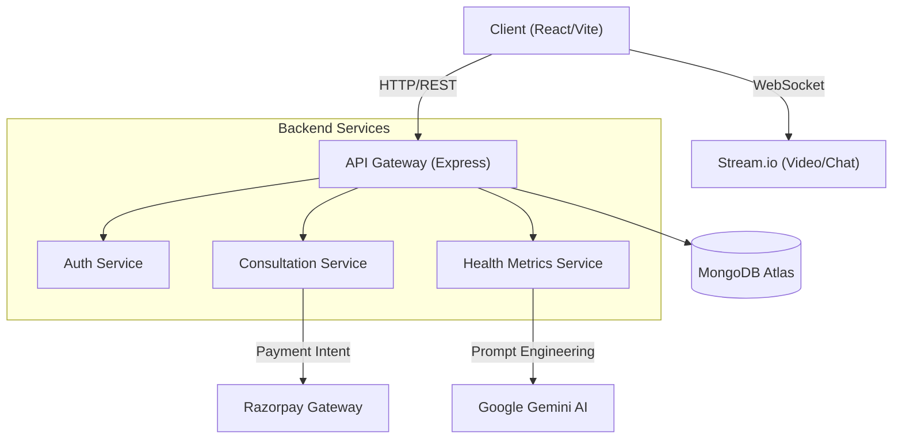

# MedSync - Advanced AI-Powered Telehealth Platform

MedSync is a comprehensive healthcare application that bridges the gap between patients and doctors through seamless video consultations, AI-driven health insights, and integrated medical services.

**🌐 Live Demo:** [https://med-sync-pearl.vercel.app/](https://med-sync-pearl.vercel.app/)

> **⚠️ DEMO DISCLAIMER**: This application is for demonstration and educational purposes only. Do not use real medical data or authentic payment instruments. All payments are simulated or in test mode.

---

## � Table of Contents

- [Key Features](#-key-features)
- [System Architecture](#-system-architecture)
- [Technology Stack](#-technology-stack)
- [Folder Structure](#-folder-structure)
- [Getting Started](#-getting-started)
- [Environment Variables](#-environment-variables)
- [API Documentation](#-api-documentation)
- [Security](#-security)

---

## �🚀 Key Features

### 🩺 For Patients
*   **Instant Video Consultations**: High-quality, low-latency video calls with doctors using the Stream SDK. Supports screen sharing and in-call chat.
*   **AI Health Tracker**: Log daily vitals (Blood Pressure, Glucose, Weight). Google Gemini analyzes these trends to provide personalized health insights and alerts for abnormal readings.
*   **Wellbeing Assistant**: An empathetic AI companion available 24/7 for mental wellness support. Includes crisis detection algorithms to recommend professional help when needed.
*   **Online Pharmacy**: Full e-commerce experience to browse medicines, view detailed information, and order with prescription verification.
*   **Lab Tests @ Home**: Book diagnostic tests. Integration with test providers for home sample collection scheduling.
*   **Symptom Checker**: AI-driven preliminary assessment tool to guide patients on care urgency (Emergency vs. GP vs. Home Care).

### 👩‍⚕️ For Doctors
*   **Digital Practice Management**: Dashboard to view upcoming appointments, manage availability slots, and access patient history.
*   **Digital Prescriptions**: Create tamper-proof digital prescriptions with auto-filled medicine database.
*   **Patient Monitoring**: View comprehensive health trends and vital logs of patients before and during consultations.

### 🔒 Security & Privacy
*   **Data Encryption**: All sensitive health data is encrypted at rest using AES-256.
*   **Role-Based Access Control (RBAC)**: Strict separation of patient and doctor data execution.
*   **Secure Authentication**: JWT-based stateless authentication with httpOnly secure cookies.

---

## 🏗️ System Architecture



---

## 🛠️ Technology Stack

**Frontend**
*   **Core**: React.js 18, Vite
*   **Styling**: Tailwind CSS, Framer Motion (Animations)
*   **State**: Context API
*   **Comms**: GetStream.io (Video & Chat SDKs)

**Backend**
*   **Runtime**: Node.js v18+
*   **Framework**: Express.js
*   **Database**: MongoDB (Mongoose ODM)
*   **Security**: Helmet, Rate Limiting, bcrypt, crypto (Node built-in)

**DevOps & Tools**
*   **Hosting**: Vercel (Frontend), Render (Backend)
*   **CI/CD**: Automatic deployments via Git hooks
*   **Linting**: ESLint

---

## 📂 Folder Structure

```
Med-site/
├── client/                 # React Frontend
│   ├── src/
│   │   ├── components/     # Reusable UI components
│   │   ├── pages/          # Full page views (routes)
│   │   ├── context/        # React Contexts (Auth, Cart, Stream)
│   │   └── utils/          # Helpers (Axios instance, formatting)
│   └── ...
├── server/                 # Express Backend
│   ├── controllers/        # Request logic
│   ├── models/             # Mongoose Schemas
│   ├── routes/             # API Route definitions
│   ├── utils/              # Encryption, AI Helpers, Error Handling
│   └── ...
└── README.md
```

---

## ⚡ Getting Started

### Prerequisites
*   Node.js (v18+)
*   MongoDB (Local or Atlas Connection String)
*   API Keys for: [Google AI Studio](https://aistudio.google.com/), [GetStream](https://getstream.io/), [Razorpay](https://razorpay.com/)

### 1. Backend Setup

```bash
cd server
npm install
```

Create a `.env` file in the `server` directory:

```env
PORT=5000
MONGO_URI=mongodb+srv://<username>:<password>@cluster.mongodb.net/medsync?retryWrites=true&w=majority
JWT_SECRET=your_super_secret_jwt_key
NODE_ENV=development

# Encryption (32-byte hex string)
ENCRYPTION_KEY=fb9e153f5599b445a65ccd56b7f495ca6361788a75d7311ee2fd2cc96cd9758e

# Stream (Video/Chat)
STREAM_API_KEY=your_stream_key
STREAM_API_SECRET=your_stream_secret

# AI
GEMINI_API_KEY=your_gemini_key

# Payments (Test Mode)
RAZORPAY_KEY_ID=your_razorpay_id
RAZORPAY_KEY_SECRET=your_razorpay_secret
```

Start the server:
```bash
npm start
```

### 2. Frontend Setup

```bash
cd client
npm install
```

Create a `.env` file in the `client` directory:

```env
VITE_API_URL=http://localhost:5000/api
VITE_STREAM_KEY=your_stream_key_(same_as_backend)
```

Start the development server:
```bash
npm run dev
```

---

## � API Documentation

### Auth
*   `POST /api/v1/users/signup` - Register new patient
*   `POST /api/v1/users/login` - Login (Patient/Doctor)

### Doctors
*   `GET /api/v1/doctors` - List all doctors with filters
*   `GET /api/v1/doctors/:id/availability` - Get available slots

### Health Tracker
*   `POST /api/v1/health-metrics` - Log a new vital (Encrypted)
*   `GET /api/v1/health-metrics/my` - Fetch history (Decrypted)
*   `POST /api/v1/health-metrics/insights` - Generate AI analysis

---

## 🛡️ Security

MedSync takes security seriously. Key measures include:
1.  **Zero-Knowledge Logging**: PII is never logged to console or files.
2.  **Field-Level Encryption**: Health metrics are encrypted before database insertion using `AES-256-CBC`.
3.  **Secure Headers**: Implemented using `helmet` to prevent XSS and clickjacking.

---

## 🤝 Contact

Created by **Vishnu KV** & Team.
For inquiries, please reach out via [GitHub Issues](https://github.com/).
